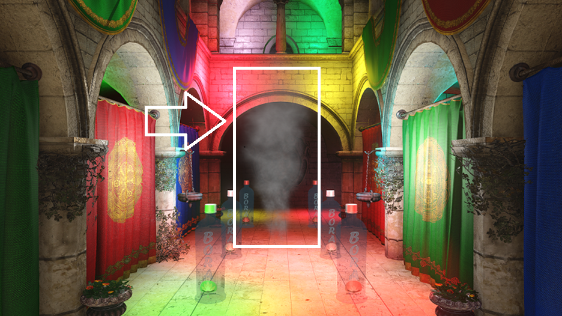
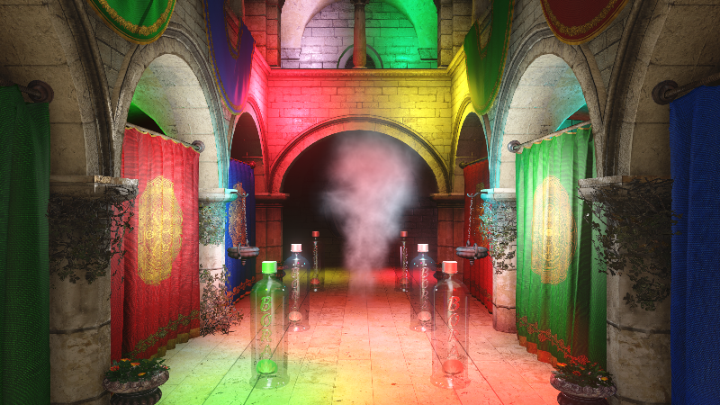

# computer_graphics_finalproject
Final project of the computer graphics course @ ucsp

---

**As to last change, way back in June.**

**The report is [here](https://ts/cg/)**

## Cloning the project

The project depends on some libraries, which are added as submodules. Make sure you clone the project with the --recursive option, in order to get the dependencies from other repositories.

  git clone

## Build steps

I've test it with both Windows 10 and Ubuntu 16.04. 

Also, make sure you are using an out of place build, by making a build directory and compiling the code there.

	mkdir build
	cd build
	cmake-gui or cmake OPTIONS ..

### Windows

### Linux

Tested in Ubuntu 16.04, using g++ and makefiles. 

To build, just run ** cmake .. ** from the build directory.

### Running the demos

The current demo I have is the testScenario demo. Depending on your platform, just set it as a startup project ( visual studio ), or just run the generated binary in the build directory ( linux )

